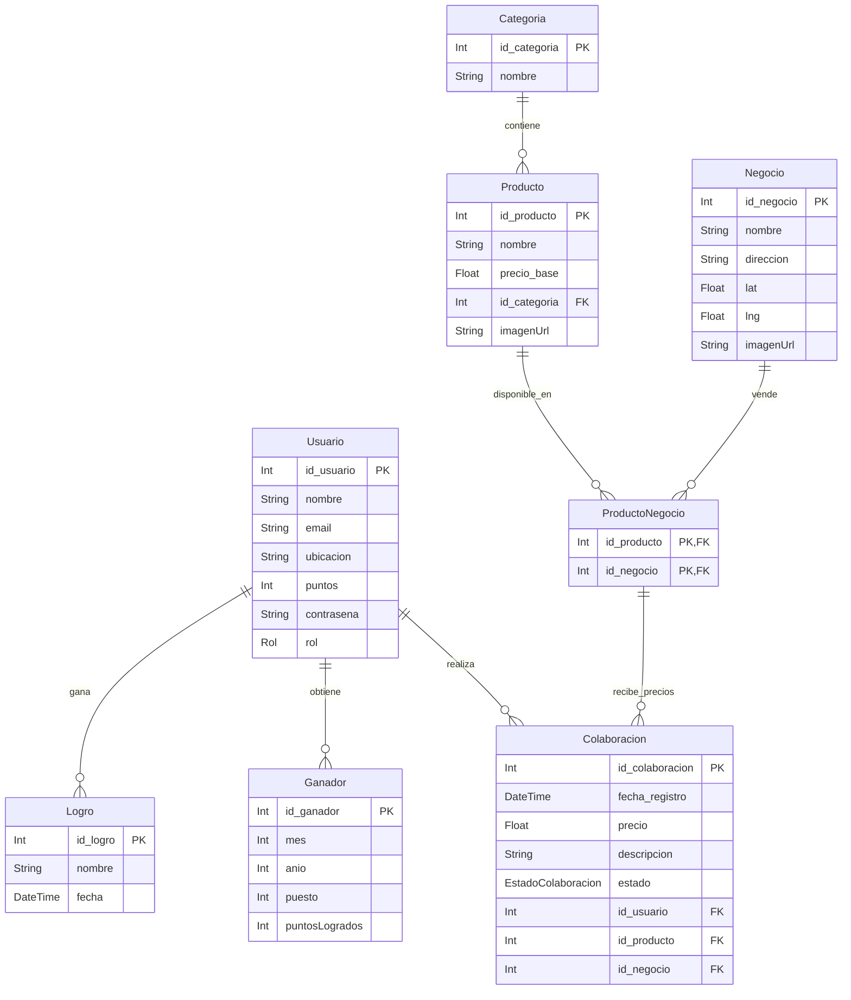

# 📚 Diagrama ER

Este es el modelo Entidad-Relación (ER) que define la estructura de datos de Don Descu.

## 📋 Tablas

### Usuario
Almacena la información de los vecinos de Libertador. Incluye el sistema de puntos y el rol (`USER` / `ADMIN`) para la moderación.

### Producto
Catálogo general de artículos. No tiene un precio fijo, ya que este varía según el negocio.

### Categoria
Clasificación de los productos (Almacén, Limpieza, Verdulería) para facilitar las búsquedas.

### Negocio
Registra los comercios locales. Incluye coordenadas `lat` y `lng` para mostrar la ubicación exacta en el mapa.

### ProductoNegocio
Tabla intermedia que vincula productos con locales. Representa la existencia de un producto específico en un comercio determinado.

### Colaboracion
La tabla de actividad. Registra cada vez que un usuario reporta un precio. Requiere aprobación (`estado`) para sumar puntos al usuario.

### Ganador
Historial del ranking mensual. Guarda quiénes fueron los usuarios destacados de cada mes.

### Logro
Medallas otorgadas a los usuarios por hitos específicos (ej. "Primer aporte", "Cazador de ofertas").